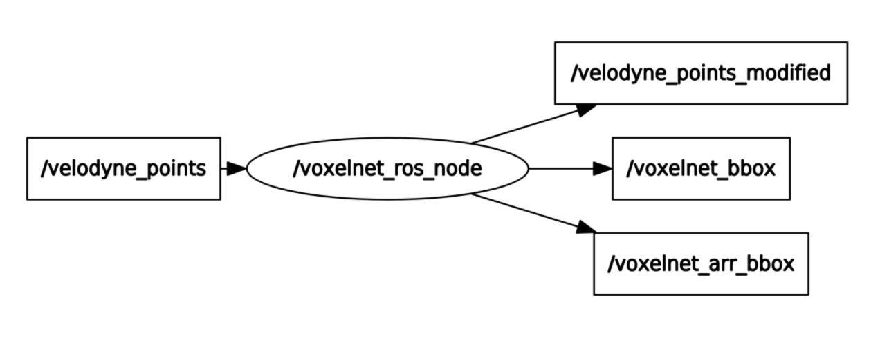

## Voxelnet ROS Implementation (Not Completely Implemented yet)
----
VoxelNet Implementation codes from "https://github.com/qianguih/voxelnet"

#### Instructions
- clone this repository
- move voxelnet_ros folder to your `catkin_ws`
- `catkin_make`
- `roscd voxelnet/script/`
- `python3 voxelnet_ros.py`
  - unfortunately, `rosrun voxelnet_ros voxelnet_ros.py` won't work. because it's using Python 3.x instead of 2.x
  
### ROS Node 
- Subscribe `velodyne_points`
- Publish `voxelnet_arr_bbox` 
- Other Publishers are for testing

### Rviz Animation

### Future Work
- Not yet
- If you face any kind of bugs or issues while using it, Post it on Issues! Thank you
